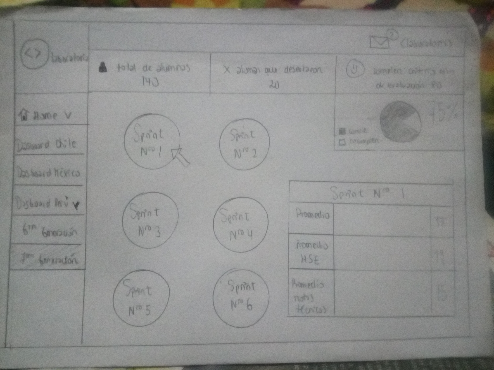

### "Dasboard" ###

--------------------------------------------------------------

1) __OBJETIVO__

  Para este ejercicio nos indican que debemos hacer un sketch del dashboard de Laboratoria.

2) __DESARROLLO__

  A) Navegación Global :

    * Dasboard Chile
    * Dasboard México
    * Dasboard Perú

   B) filtros :

   * Sprint nro 1
   * Sprint nro 2
   * Sprint nro 3
   * Sprint nro 4
   * Sprint nro 5
   * Sprint nro 6

   C)Facetada:

   * Promedio
   * Promedio HSE
   * Promedio notas técnicas

   
